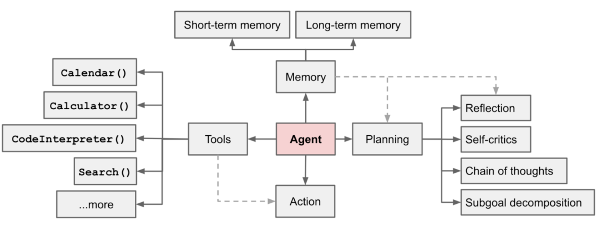

[**🇨🇳中文**](https://github.com/shibing624/actionflow/blob/main/README.md) | [**🌐English**](https://github.com/shibing624/actionflow/blob/main/README_EN.md)

<div align="center">
  <a href="https://github.com/shibing624/actionflow">
    
  </a>
</div>

-----------------

# Actionflow: Agent Workflows with Prompts and Tools
[](https://badge.fury.io/py/actionflow)
[](https://pepy.tech/project/actionflow)
[](CONTRIBUTING.md)
[](LICENSE)
[](requirements.txt)
[](https://github.com/shibing624/actionflow/issues)
[](#Contact)


**actionflow**: A Human-Centric Framework for Large Language Model Agent Workflows, build your agent workflows quickly

**actionflow**: 快速构建你自己的Agent工作流

`Actionflow`是一个Agent工作流构建工具，功能：

- 简单代码快速编排复杂工作流
- 工作流的编排不仅支持prompt命令，还支持工具调用（tool_calls）
- 支持OpenAI API和Moonshot API(kimi)调用

## Why Actionflow


**规划（Planning）**
- 子目标和分解：`LLM Agent`能够将大型任务分解为较小的、可管理的子目标，以便有效的处理复杂任务
- 反思和细化：`LLM Agent`可以对过去的行为进行自我批评和反省，从错误中吸取经验教训，并为接下来的行动进行分析、总结和提炼，这种反思和细化可以帮助`Agent`提高自身的智能和适应性，从而提高最终结果的质量

**记忆 （Memory）**
- 短期记忆：所有上下文学习都是依赖模型的短期记忆能力进行的，通常是指写到prompt中的信息
- 长期记忆：这种设计使得`Agent`能够长期保存和调用无限信息的能力，一般通过外部载体存储和快速检索来实现

**工具使用（Tool use）**
- `LLM Agent`可以学习如何调用外部API，以获取外部信息，包括当前日期、日历、代码执行能力、对专用信息源的访问等


- Planner：负责让LLM生成一个多步计划来完成一个大任务，可以生成一个相互依赖的“链式计划”，定义每一步所依赖的上一步的输出
- Worker：接受“链式计划”，循环遍历计划中的每个子任务，并调用工具完成任务，可以自动反思纠错以完成任务
- Solver：求解器将所有这些输出整合为最终答案

## Installation

```bash
pip install -U actionflow
```

or

```bash
git clone https://github.com/shibing624/actionflow.git
cd actionflow
pip install .
```

## Getting Started

1. 复制[example.env](https://github.com/shibing624/actionflow/blob/main/example.env)文件为`.env`，并粘贴OpenAI API key或者Moonshoot API key。

2. 运行Agent示例：

```bash
cd examples
python run_flow_demo.py --flow_path flows/example.json
```


### 工作流（Workflow）

## Contact

- Issue(建议)
  ：[](https://github.com/shibing624/actionflow/issues)
- 邮件我：xuming: xuming624@qq.com
- 微信我： 加我*微信号：xuming624, 备注：姓名-公司-NLP* 进NLP交流群。


## Citation

如果你在研究中使用了`actionflow`，请按如下格式引用：

APA:

```
Xu, M. actionflow: A Human-Centric Framework for Large Language Model Agent Workflows (Version 0.0.2) [Computer software]. https://github.com/shibing624/actionflow
```

BibTeX:

```
@misc{Xu_actionflow,
  title={actionflow: A Human-Centric Framework for Large Language Model Agent Workflows},
  author={Xu Ming},
  year={2024},
  howpublished={\url{https://github.com/shibing624/actionflow}},
}
```

## License

授权协议为 [The Apache License 2.0](/LICENSE)，可免费用做商业用途。请在产品说明中附加`actionflow`的链接和授权协议。
## Contribute

项目代码还很粗糙，如果大家对代码有所改进，欢迎提交回本项目，在提交之前，注意以下两点：

- 在`tests`添加相应的单元测试
- 使用`python -m pytest`来运行所有单元测试，确保所有单测都是通过的

之后即可提交PR。

## Acknowledgements 

- [https://github.com/langchain-ai/langchain](https://github.com/langchain-ai/langchain)
- [https://github.com/simonmesmith/agentflow](https://github.com/simonmesmith/agentflow)
- [https://github.com/phidatahq/phidata](https://github.com/phidatahq/phidata)


Thanks for their great work!
