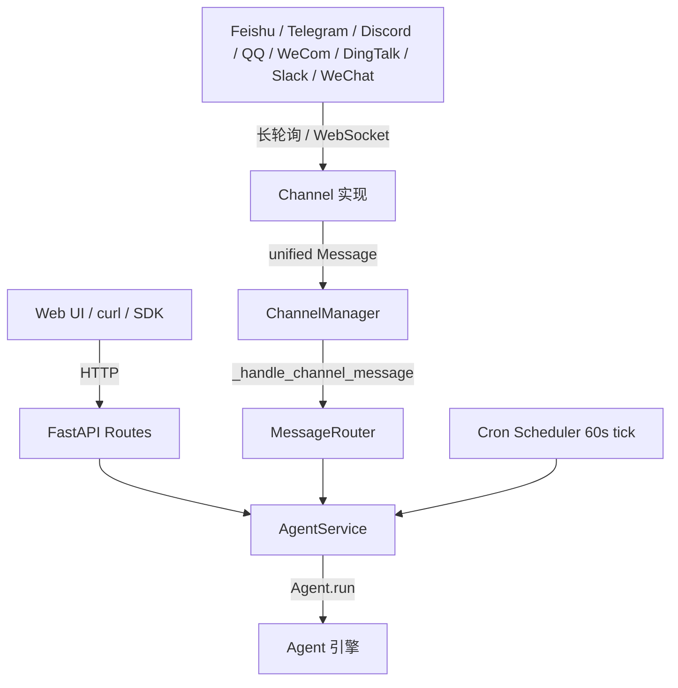

# Gateway

Gateway 是 Agentica 的"长跑服务"层：把一个 `Agent` 实例暴露为
HTTP API + WebSocket 流式接口 + 多个 IM 平台机器人 + 定时任务调度器，
全部跑在同一个 FastAPI 进程里。

适用场景：

- 把 Agent 封装成内网 / 公网服务，给前端 Web UI、CLI、移动端共享调用
- 让 Agent 同时接入多个 IM 平台（飞书 / Telegram / Discord / QQ / 企业微信 / 钉钉 / Slack / 个人微信），跨渠道复用同一套对话上下文
- 周期性执行 Agent 任务（cron 调度）

## 安装

```bash
pip install "agentica[gateway]"
```

按需追加 IM 平台 SDK（每个 IM 都是可选 extras，不装则该渠道自动跳过）：

```bash
pip install "agentica[telegram]"   # python-telegram-bot
pip install "agentica[discord]"    # discord.py
pip install "agentica[qq]"         # qq-botpy（QQ 开放平台 WebSocket）
pip install "agentica[wecom]"      # wecom_aibot_sdk（企业微信 AI Bot）
pip install "agentica[dingtalk]"   # dingtalk-stream（钉钉 Stream）
pip install "agentica[wechat]"     # 个人微信（微信 ClawBot / iLink 官方协议，含媒体 AES-128-ECB + CDN）
```

> 飞书（Lark）SDK `lark-oapi` 已经包含在基础 `[gateway]` 里。

启动：

```bash
agentica-gateway
# 等价：python -m agentica.gateway.main
```

默认监听 `0.0.0.0:8789`，浏览器打开 `http://localhost:8789/chat` 进入内置 Web UI。

启动日志会明确区分两类服务，避免与 IM 渠道混淆：

```
Web service started — http://0.0.0.0:8789/chat            # 始终运行的 Web / HTTP 服务
IM channels started — wechat, wecom                       # 按配置启用的 IM 渠道
# 或：IM channels — none enabled (configure a channel to enable)
```

其中 `Work dir` 行显示当前传给 Agent 的 project 工作目录（默认即启动 `agentica-gateway` 时所在的目录，见下文"工作目录"）。

## 整体架构



核心抽象：

| 类 | 文件 | 职责 |
|----|------|------|
| `Channel` (ABC) | [`agentica/gateway/channels/base.py`](https://github.com/shibing624/agentica/blob/main/agentica/gateway/channels/base.py) | IM 渠道协议：`connect / disconnect / send` + allowlist + `split_text` |
| `Message` (dataclass) | 同上 | 跨平台统一消息格式（`channel`, `channel_id`, `sender_id`, `content`, `metadata` …） |
| `ChannelManager` | `services/channel_manager.py` | 渠道注册 / 生命周期 / 统一发送入口 |
| `MessageRouter` | `services/router.py` | 把 `Message` 路由到具体 `agent_id` + 计算稳定 `session_id` |
| `AgentService` | `services/agent_service.py` | LRU Agent 缓存 + `chat(message, session_id, user_id)` 主入口 |

每个 IM 渠道只做"把平台原生消息翻译成 `Message` + 把回复文本发回平台"两件事，
其它统一由 Gateway 层完成。

## 支持的渠道一览

| 渠道 | 依赖 extras | 连接方式 | 需要公网 | 启用所需环境变量 |
|------|------------|----------|----------|------------------|
| 飞书 Lark | 内置 `[gateway]` | WebSocket 长连接 | 否 | `FEISHU_APP_ID` + `FEISHU_APP_SECRET` |
| Telegram | `telegram` | 长轮询 | 否 | `TELEGRAM_BOT_TOKEN` |
| Discord | `discord` | Gateway 长连接 | 否 | `DISCORD_BOT_TOKEN` |
| QQ | `qq` | qq-botpy WebSocket | 否 | `QQ_APP_ID` + `QQ_APP_SECRET` |
| 企业微信 | `wecom` | wecom_aibot_sdk WS | 否 | `WECOM_BOT_ID` + `WECOM_SECRET` |
| 钉钉 | `dingtalk` | dingtalk-stream | 否 | `DINGTALK_CLIENT_ID` + `DINGTALK_CLIENT_SECRET` |
| Slack | `slack` | Socket Mode WS | 否 | `SLACK_BOT_TOKEN` + `SLACK_APP_TOKEN` |
| 个人微信 | `wechat` | ilinkai HTTP 长轮询 | 否 | `WECHAT_TOKEN_FILE` 或 `WECHAT_ALLOWED_USERS` |

> 所有渠道都**不需要公网 IP / 域名 / webhook**：飞书 / QQ / 企业微信 / Slack 走各自厂商的
> WebSocket 长连，Telegram / Discord / 个人微信走长轮询或 HTTP 轮询，内网部署即可。

## 配置（环境变量）

所有配置都通过环境变量读取，推荐写在项目根目录的 `.env` 文件里。
完整字段定义见 [`agentica/gateway/config.py`](https://github.com/shibing624/agentica/blob/main/agentica/gateway/config.py)。

### 服务器与模型

| 变量 | 默认 | 说明 |
|------|------|------|
| `HOST` | `0.0.0.0` | 监听地址 |
| `PORT` | `8789` | 监听端口 |
| `GATEWAY_TOKEN` | 空 | 设置后所有 `/api/*` 与 `/ws` 强制 `Authorization: Bearer <token>` |
| `AGENTICA_MODEL_PROVIDER` | `zhipuai` | 主模型 provider |
| `AGENTICA_MODEL_NAME` | `glm-4.7-flash` | 主模型名 |
| `AGENTICA_MODEL_THINKING` | 空 | 思维链模式开关（如 `enabled`） |
| `OPENAI_API_KEY` / 各家 provider key | — | 走标准 provider 配置 |

> 不设 `GATEWAY_TOKEN` 时仅适合本地 dev；公网部署务必设置 token。

### 工作目录（Project Work Dir）

Agent 操作的 project 根目录由 `AGENTICA_BASE_DIR` 控制，默认 = **启动 `agentica-gateway` 时所在的目录**（`os.getcwd()`），与 CLI 行为一致——不显式配置时直接对当前项目目录工作，而不会像旧版本那样落到 `$HOME`。

| 变量 | 默认 | 说明 |
|------|------|------|
| `AGENTICA_BASE_DIR` | 启动目录 `os.getcwd()` | Agent 的 project 工作目录（读写文件、执行命令的基准） |

```bash
AGENTICA_BASE_DIR=/path/to/your/project   # 可选，显式指定工作目录
agentica-gateway
```

> 这与 **记忆工作区** `AGENTICA_WORKSPACE_DIR`（默认 `~/.agentica/workspace`，存放长期记忆 / `AGENTICA.md`）是两个不同的概念：前者是 Agent 对外"干活"的项目目录，后者是 Agent 内部状态存储，互不干扰。

### 飞书（Lark）

```bash
FEISHU_APP_ID=cli_xxx
FEISHU_APP_SECRET=xxx
FEISHU_ALLOWED_USERS=ou_xxx,ou_yyy   # 留空 = 任何用户都可访问
FEISHU_ALLOWED_GROUPS=oc_zzz
```

申请：[飞书开放平台](https://open.feishu.cn) → 创建企业自建应用 → 启用"机器人"能力 →
开通"接收消息" 权限 → 配置长连接 / WebSocket。

### Telegram

```bash
TELEGRAM_BOT_TOKEN=123456:ABCDEF...
TELEGRAM_ALLOWED_USERS=12345678,87654321   # Telegram 数字 user_id
```

申请：在 Telegram 里和 [@BotFather](https://t.me/BotFather) 对话 → `/newbot` → 拿到 token。
渠道使用长轮询，**无需公网 webhook**。

### Discord

```bash
DISCORD_BOT_TOKEN=MTAxxxxx.xxxx.xxxx
DISCORD_ALLOWED_USERS=user_id_1,user_id_2
DISCORD_ALLOWED_GUILDS=guild_id_1          # 可留空 = 不限服务器
```

申请：[Discord Developer Portal](https://discord.com/developers/applications) →
New Application → Bot → 开启 `MESSAGE CONTENT INTENT` → 复制 token。

### QQ（QQ 开放平台官方机器人）

```bash
QQ_APP_ID=102xxxxx
QQ_APP_SECRET=xxxxx
QQ_ALLOWED_USERS=user_openid_1,user_openid_2
```

申请：[QQ 开放平台](https://q.qq.com) → 创建机器人 → 拿到 AppID / AppSecret。
渠道使用 `qq-botpy` 的 Intents WebSocket，**无需公网 webhook**。

行为说明：

- 同时支持 **C2C 私聊**（`channel_id = openid`）和 **群 @ 消息**（`channel_id = "group:<group_openid>"`）
- 用户的 `openid` 在 ta 第一次发消息时由 QQ 平台分配；想加白名单时观察 gateway 日志即可拿到
- 因为 QQ 主动推送 API 要求带原始 `msg_id`，渠道会自动缓存每个会话最新的 `msg_id`，外部调用 `/api/send` 时透传即可

### 企业微信（WeCom）

```bash
WECOM_BOT_ID=your_bot_id
WECOM_SECRET=your_bot_secret
WECOM_ALLOWED_USERS=user_id_1,user_id_2
```

申请：企业微信管理后台 → 智能机器人 → 创建 AI Bot → 拿到 `bot_id` + `secret`。
渠道使用 `wecom_aibot_sdk` 的 WSClient，**无需公网 webhook**。

实现细节：企业微信回包必须用收到时的原始 `frame`，渠道内部维护
`{chat_id: frame}` 缓存；如果调用 `/api/send` 给一个从未发过消息的会话，
该次发送会失败并写日志（这是平台限制，不是 bug）。

### 钉钉（DingTalk）

```bash
DINGTALK_CLIENT_ID=your_app_key
DINGTALK_CLIENT_SECRET=your_app_secret
DINGTALK_ALLOWED_USERS=staff_id_1,staff_id_2
```

申请：[钉钉开放平台](https://open.dingtalk.com) → 创建企业内部应用 → 开通"机器人"能力 →
拿到 AppKey / AppSecret（即 client_id / client_secret）。

实现细节：

- 入站使用 `dingtalk-stream` 的 Stream 长连接
- 出站走 HTTP，`accessToken` 由渠道内部缓存（带过期续期，60 秒缓冲）
- **私聊**：`channel_id = sender_staff_id`，发送到 `/v1.0/robot/oToMessages/batchSend`
- **群消息**：`channel_id = "group:<openConversationId>"`，发送到 `/v1.0/robot/groupMessages/send`
- 默认以 `sampleMarkdown` 消息卡片发送（标题 "Agent Reply"）

### Slack

```bash
SLACK_BOT_TOKEN=xoxb-xxx          # Bot User OAuth Token
SLACK_APP_TOKEN=xapp-xxx          # App-Level Token（用于 Socket Mode）
SLACK_ALLOWED_USERS=U123,U456     # 留空 = 任何用户都可访问
SLACK_ALLOWED_CHANNELS=C789       # 留空 = 接收所有频道；填了则只接收这些会话
```

申请：

1. [api.slack.com](https://api.slack.com/apps) → Create New App → 从 scratch 创建
2. **OAuth & Permissions** → 添加 Bot Token Scopes：`app_mentions:read`、`channels:history`、
   `chat:write`、`groups:history`、`im:history`、`im:write`、`mpim:history`
3. 安装到工作区，复制 **Bot User OAuth Token**（`xoxb-` 开头）→ `SLACK_BOT_TOKEN`
4. **Socket Mode** → 开启 → Generate an App-Level Token（`xapp-` 开头）→ `SLACK_APP_TOKEN`
5. **Event Subscriptions**（Socket Mode 下）订阅 `message.channels` / `message.groups` /
   `message.im` / `app_mention`

实现细节：

- 使用 **Socket Mode**，所有事件走 Slack 维护的 WebSocket，**无需公网 webhook / 域名**
- 入站监听在后台线程，通过 `run_coroutine_threadsafe` 派发到主事件循环
- 自动忽略机器人自己的消息、频道加入通知、消息编辑等噪音事件（`app_mention` 与 `message` 正常接收）
- `channel_id` 即 Slack 会话 id（`D...` 私聊 / `C...` 频道），可直接用于 `/api/send`
- 长文本按 3000 字符分片发送；`send(..., thread_ts=...)` 可指定线程回复

### 个人微信（WeChat）

> 📌 **协议说明**：该渠道直连微信官方 **ClawBot / iLink** 后端（`https://ilinkai.weixin.qq.com`），
> 与腾讯开源的 `@tencent-weixin/openclaw-weixin` Node 插件是**同一套 HTTP 协议**的 Python 实现，
> 无需启动任何 Node 进程。文本与媒体（图片 / 文件 / 语音 / 视频）均支持：媒体先以
> **AES-128-ECB（PKCS7）** 加密后上传至 CDN，回包头 `x-encrypted-param` 作为 `encrypt_query_param`
> 回填进 `CDNMedia` 引用，随 `sendmessage` 下发。
>
> ⚠️ **风险提示**：iLink 协议可能随微信升级调整。仅推荐用于个人 / 内部小范围实验场景。

```bash
WECHAT_TOKEN_FILE=/abs/path/to/token.json   # 可选，默认 ~/.agentica/cache/wxbot_token.json
WECHAT_ALLOWED_USERS=wx_user_id_1
```

#### 启用条件（重要）

为了避免 `agentica-gateway` 每次启动都弹出扫码窗口，
微信渠道**只在以下任一变量被显式设置时**才会注册：

```python
# agentica/gateway/main.py
if settings.wechat_token_file or settings.wechat_allowed_users:
    deps.channel_manager.register(WeChatChannel(...))
```

| 你设置了… | 行为 |
|----------|------|
| 都没设 | 渠道**不注册**，gateway 启动安静无打扰 ✅ |
| 仅 `WECHAT_TOKEN_FILE` | 渠道注册；`token.json` 存在 → 直接复用；不存在 → **触发扫码登录** |
| 仅 `WECHAT_ALLOWED_USERS` | 渠道注册；按默认路径 `~/.agentica/cache/wxbot_token.json` 加载；如果该文件不存在 → **同样触发扫码登录** |
| 两个都设 | 同上，只是 token 落盘到你指定的路径 |

> ⚠️ 这意味着只用 `WECHAT_ALLOWED_USERS` 做"白名单收紧"是不够安全的——
> 只要默认 token 路径下没有有效凭据，gateway 在启动时就会拉起一个后台
> 扫码流程（PNG 写到 `<token_file_dir>/wx_qr.png` 并尝试用默认浏览器打开）。
>
> **生产部署建议**：
>
> 1. 在受控环境完成一次扫码，把生成的 `token.json` 备份；
> 2. 用 `WECHAT_TOKEN_FILE` 显式指定该文件的部署路径；
> 3. 只在这台机器上启用微信渠道，token 失效时手动重扫并替换文件，
>    不要让无人值守的 gateway 进程意外触发交互式登录。

#### 首次启动行为

1. 找不到缓存 token → 渠道在后台线程里调用 `WxBotClient.login_qr()`
2. 在**终端直接打印一张 ASCII 二维码**（SSH / 无桌面环境也能直接拿手机扫），
   同时把 PNG 自动保存到 `<token_file_dir>/wx_qr.png` 并尝试用默认浏览器打开（PNG 需要 Pillow）
3. 用微信扫码确认 → token 落盘 `WECHAT_TOKEN_FILE`
4. 后续启动直接从 token 文件恢复

#### 实现细节

- 上行：阻塞 `run_loop` 跑在 daemon 线程里，通过 `loop.call_soon_threadsafe()` 派发到主事件循环
- 下行：每条回复用 `asyncio.to_thread(send_text)` 调用同步客户端
- 渠道自动缓存每个用户最新的 `context_token`，回复时回填以保持微信侧对话线索

## 提供的 HTTP API

启动后访问 `http://localhost:8789/docs` 查看 OpenAPI 全文档。常用：

| Method | Path | 说明 |
|--------|------|------|
| GET | `/health` / `/api/health` | 健康检查（免 token） |
| GET | `/chat` | 内置 Web UI（免 token） |
| POST | `/api/chat` | 触发一轮 agent 对话（JSON body：`message`, `session_id`, `user_id`） |
| WS | `/ws` | 流式事件订阅 |
| GET | `/api/channels` | 列出已注册渠道 + 连接状态 |
| POST | `/api/send` | 主动向某个 IM 渠道发送一条消息 |
| GET | `/api/jobs` 等 | Cron / 定时任务管理（详见 routes/scheduler.py） |

`/api/send` 示例：

```bash
curl -X POST http://localhost:8789/api/send \
  -H "Authorization: Bearer $GATEWAY_TOKEN" \
  -H "Content-Type: application/json" \
  -d '{
    "channel": "qq",
    "channel_id": "group:abc123",
    "message": "服务部署完成 ✅"
  }'
```

`channel` 可选值：`feishu` / `telegram` / `discord` / `qq` / `wecom` / `dingtalk` / `slack` / `wechat` / `web`。

## 消息路由

`MessageRouter` 决定每条入站消息交给哪个 `agent_id` 处理。默认所有消息路由到 `default_agent="main"`，
你可以按 `channel` / `channel_id` / `sender_id` 加规则：

```python
from agentica.gateway.services.router import RoutingRule
from agentica.gateway.channels.base import ChannelType
from agentica.gateway import deps

# 把所有 Telegram 消息交给 tg_agent
deps.message_router.add_rule(
    RoutingRule(agent_id="tg_agent", channel=ChannelType.TELEGRAM, priority=10)
)

# 把某个 QQ 群单独路由给专门的 agent
deps.message_router.add_rule(
    RoutingRule(
        agent_id="ops_agent",
        channel=ChannelType.QQ,
        channel_id="group:abc123",
        priority=20,
    )
)
```

会话 ID 由路由器统一生成：`agent:{agent_id}:{channel}:{channel_id}`，
保证跨渠道复用同一 Agent 时，每个会话拥有独立的上下文。

## 自定义渠道

继承 `Channel` 即可接入任何新平台：

```python
from agentica.gateway.channels.base import Channel, ChannelType, Message

class MyChannel(Channel):
    @property
    def channel_type(self) -> ChannelType:
        return ChannelType.WEB  # 或新增枚举值

    async def connect(self) -> bool:
        # 启动 SDK / 长轮询任务
        self._connected = True
        return True

    async def disconnect(self):
        self._connected = False

    async def send(self, channel_id: str, content: str, **kwargs) -> bool:
        # 调用平台 SDK 发送
        for chunk in self.split_text(content, max_len=2000):
            ...
        return True
```

注册到 ChannelManager：

```python
from agentica.gateway import deps
deps.channel_manager.register(MyChannel())
await deps.channel_manager.connect_all()
```

## 定时任务（Cron）

Gateway 内建一个文件化的定时任务调度器，可让 Agent 在指定时刻自动跑 prompt，
结果落盘保存。调度器默认关闭，在 `~/.agentica/config.yaml` 的 `settings` 块打开
（与 CLI 的 `/cron daemon on` 共用同一个开关）：

```yaml
settings:
  cron.enabled: true
  cron.interval: 60        # 轮询间隔（秒），默认 60
```

打开后日志出现 `Cron scheduler started (60s tick)`。任务通过 HTTP API
（`/api/scheduler/jobs`）或 CLI（`/cron add ...`）创建，支持 cron 表达式、
自然语言间隔（`30m` / `every 2h`）和一次性 ISO datetime 三种调度语法。

完整用法（字段说明、管理接口、运行结果查看）见
[定时任务（Cron）](../guides/cron_scheduler.md)。

## 故障排查

- **某个渠道启动后立刻报 "Missing xxx, skipped"**：环境变量没设，渠道被跳过；这是正常行为
- **`pip install agentica[xxx]`：找不到 extras**：检查使用的是 `agentica` 包名（非旧名），且 pip 版本 ≥ 21
- **WeCom `send` 一直返回 False**：该 chat 还没收到过用户消息，没有缓存到 `frame`；让用户先发一条
- **DingTalk 401 / errcode 9001**：`accessToken` 过期或 robotCode 与 ChatBot 创建时不一致，检查 `DINGTALK_CLIENT_ID`
- **WeChat 扫码后无响应**：检查日志里 `bot_id` 是否落盘到 `WECHAT_TOKEN_FILE`；如已过期把 token 文件删了重启即可重新扫码

## 下一步

- [ACP 集成](acp.md) — 把 Agent 接入 IDE
- [MCP 集成](mcp.md) — 让 Agent 能调用外部工具协议
- [Hooks](hooks.md) — 监听 Agent 事件流
