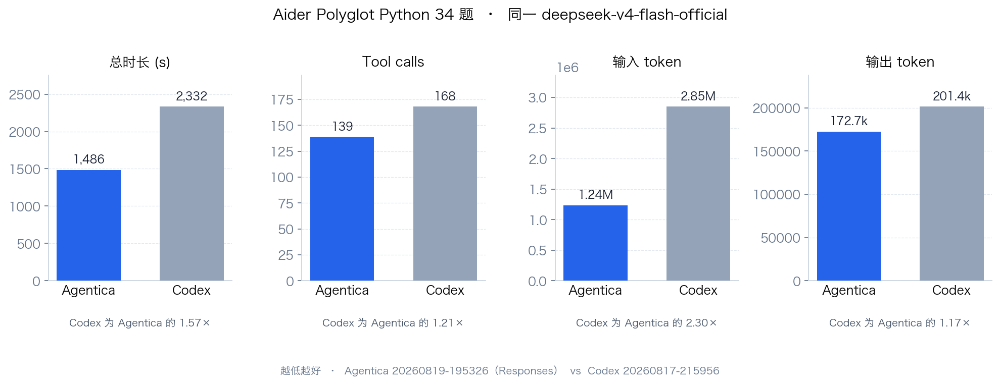

# 评测

Agentica 与 Codex CLI 在同一套题目、同一套 pytest 上的对照。底模都是 `deepseek-v4-flash-official`，题集是 [Aider Polyglot](https://github.com/Aider-AI/polyglot-benchmark) 的 **Python 全量 34 题**（官方全榜 225 题含其它语言；本仓库 runner 只跑 Python 子集）。不对 Docker / SWE-bench 声称对齐。

判分在 harness 外面跑：对错、墙钟、crash、误报完成、误改文件都不读对方 TUI。原始机器输出仍在本地 `evaluation/code_benchmark/outputs/`（含 workdir，不入库）；GitHub 上只放 `summary.json` 和 `predictions.jsonl`。

## Agentica vs Codex CLI

两边质量打平：全对、0 crash、0 误报、0 误改。差距在效率——同一裁判下 Agentica 更早停、更少工具、更少 token。



| 指标 | Agentica | Codex CLI | 对比 |
|---|---|---|---|
| 准确率 | **34/34（100%）** | **34/34（100%）** | 平 |
| 平均墙钟 / 题 | **43.7s** | 68.6s | Agentica 快，Codex 慢 **1.57×** |
| 总墙钟 | **1486s** | 2332s | 25 min vs 39 min |
| tool calls | **139**（均 4.1） | 168（均 4.9） | Codex 多 **1.21×** |
| 输入 token | **1,236,109** | 2,848,928 | Codex 多 **2.30×** |
| 输出 token | **172,705** | 201,421 | Codex 多 **1.17×** |
| crash / timeout | **0/34** | **0/34** | 平 |
| 误报完成（声称 done 但 pytest 红） | **0/34** | **0/34** | 平 |
| 误改文件 | **0** | **0** | 平 |
| cache hit | 80.4% | 86.8% | 短轨迹第一轮占比更高，不当卖点 |

| 产品 | 跑次 | summary | predictions |
|---|---|---|---|
| **Agentica** | `20260819-195326-polyglot` | [summary.json](https://github.com/shibing624/agentica/blob/main/evaluation/code_benchmark/results/20260819-195326-polyglot/summary.json) | [predictions.jsonl](https://github.com/shibing624/agentica/blob/main/evaluation/code_benchmark/results/20260819-195326-polyglot/predictions.jsonl) |
| **Codex CLI** | `20260817-215956-polyglot` | [summary.json](https://github.com/shibing624/agentica/blob/main/evaluation/code_benchmark/results/20260817-215956-polyglot/summary.json) | [predictions.jsonl](https://github.com/shibing624/agentica/blob/main/evaluation/code_benchmark/results/20260817-215956-polyglot/predictions.jsonl) |

仓库内路径：`evaluation/code_benchmark/results/<run-id>/`。`summary.json` 的 `metrics` 与上表对应；`predictions.jsonl` 一行一题，含通过与否、墙钟、工具次数、token 和模型输出。

## 设定

- 模型：`deepseek-v4-flash-official`（思考开：Agentica `reasoning.effort=high`，Codex `model_reasoning_effort=high`）
- 题集：`--bench polyglot --language python --max-samples 0`（34 题）
- 裁判：题目目录里的 pytest（`--rootdir=. --noconftest`），两边同一条命令
- Agentica：`run.py --agent agentica`（默认 `--wire-api responses`；`DeepAgent` 文件读写 + `execute`，无 todo / `ls` / `glob` / `grep`）
- Codex：`--agent codex --agent-timeout 600`（`codex exec --json`，隔离 `CODEX_HOME`）
- 串行、同一兼容端点；评测把 `AGENTICA_HOME` 指到输出目录，不写 `~/.agentica`

复现（key / base-url 自己导出，不要写进命令行）：

```bash
python evaluation/code_benchmark/run.py \
  --bench polyglot --max-samples 0 --language python \
  --agent agentica --model deepseek-v4-flash-official \
  --extra-body '{"reasoning": {"effort": "high"}}'

python evaluation/code_benchmark/run.py \
  --bench polyglot --max-samples 0 --language python \
  --agent codex --agent-timeout 600 --model deepseek-v4-flash-official
```

评测入口说明见 [`evaluation/code_benchmark/README.md`](https://github.com/shibing624/agentica/blob/main/evaluation/code_benchmark/README.md)。
