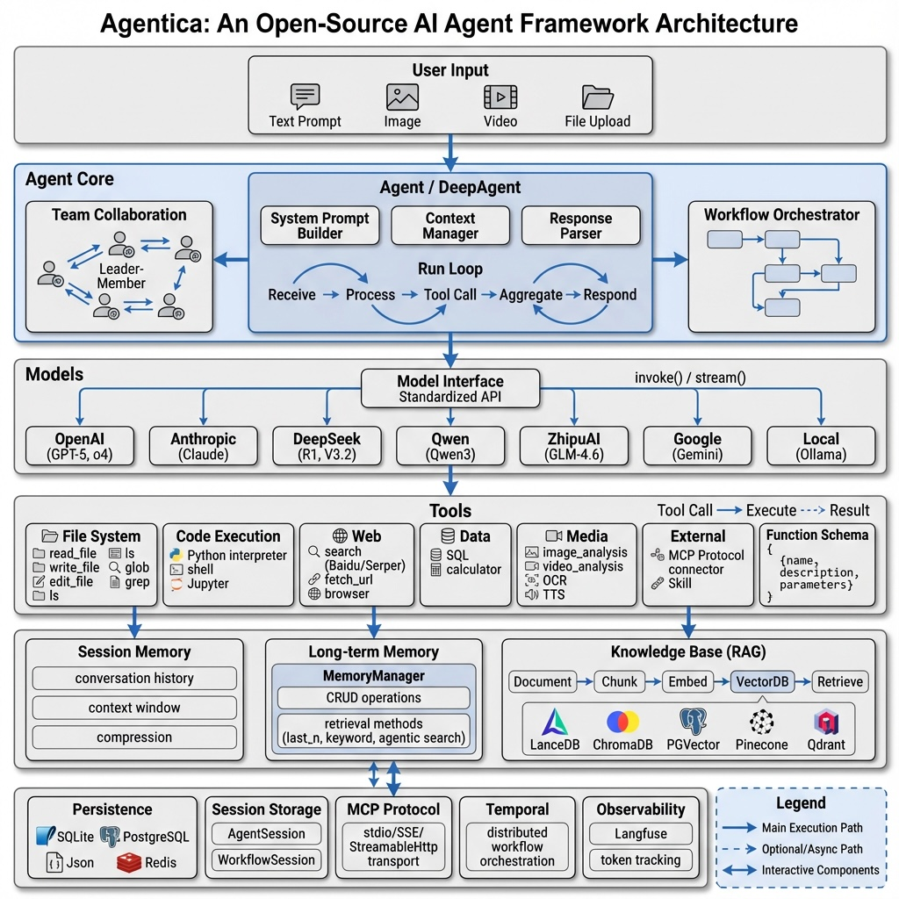

# Agentica

**轻量级、功能强大的 Python 框架，用于构建自主 AI 智能体。**

<div align="center">
  
</div>

[](https://badge.fury.io/py/agentica)
[](https://pepy.tech/project/agentica)
[](https://github.com/shibing624/agentica/blob/main/LICENSE)
[](https://github.com/shibing624/agentica)

---

## 为什么选择 Agentica？

- **Async-First 架构** — 所有核心方法原生 async，同步适配器无缝兼容。
- **开发者友好** — 简洁直观的面向对象 API，极低学习曲线。
- **模块化可扩展** — 模型、记忆后端、向量存储均可自由替换。
- **功能完备** — 内置 40+ 工具、RAG、多智能体团队、工作流编排、安全守卫。
- **生产就绪** — CLI / Web UI / API 服务多种部署方式，支持 MCP 与 ACP 协议。

## 系统架构

<div align="center">
  
</div>

## 快速导航

| 文档 | 内容 |
|------|------|
| [快速入门](quickstart.md) | 安装、环境配置、第一个 Agent |
| **核心概念** | |
| [Agent](concepts/agent.md) | Agent 核心概念、Model、Memory、Tools |
| [Team & Workflow](concepts/team.md) | 多智能体团队协作与工作流编排 |
| **使用指南** | |
| [CLI 终端](guides/terminal.md) | 命令行交互模式 |
| [工具系统](guides/tools.md) | 内置工具、自定义工具 |
| [RAG](guides/rag.md) | 知识库、向量检索、混合搜索 |
| [MCP](guides/mcp.md) | Model Context Protocol 集成 |
| [模型提供商](guides/models.md) | 20+ 模型提供商配置指南 |
| [安全守卫](guides/guardrails.md) | 输入输出验证、工具级守卫 |
| [最佳实践](guides/best_practices.md) | 设计原则、提示词工程、生产部署 |
| [Benchmark](guides/benchmark.md) | 性能评测结果 |
| **API 参考** | |
| [Agent API](api/agent.md) | Agent 类完整 API |

## 30 秒上手

```bash
pip install -U agentica
export ZHIPUAI_API_KEY="your-api-key"
```

```python
import asyncio
from agentica import Agent, ZhipuAI

async def main():
    agent = Agent(model=ZhipuAI())
    result = await agent.run("一句话介绍北京")
    print(result.content)

asyncio.run(main())
```

```
北京是中国的首都，是一座拥有三千多年历史的文化名城，也是全国的政治、文化和国际交流中心。
```

[查看完整快速入门 →](quickstart.md)

## 社区与支持

- **GitHub Issues** — [提交 issue](https://github.com/shibing624/agentica/issues)
- **微信交流群** — 添加微信号 `xuming624`，备注 "llm"

## 许可证

[Apache License 2.0](https://github.com/shibing624/agentica/blob/main/LICENSE)
